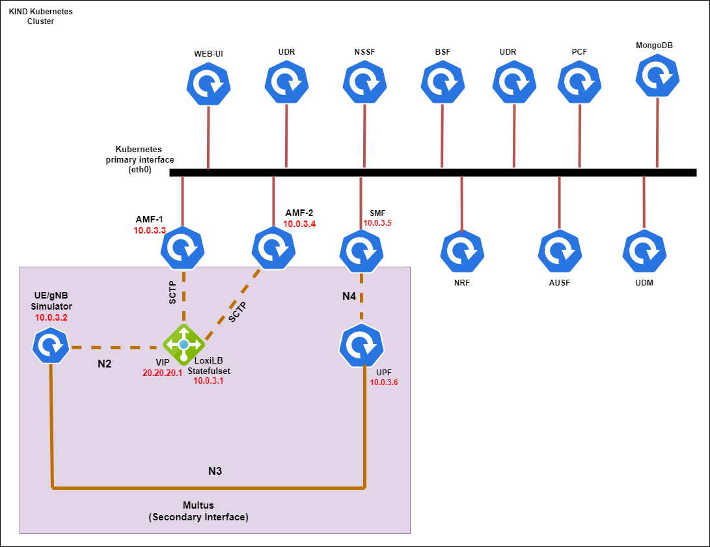

# 5gcore-sctp-loadbalancer Using LoxiLB


- Install docker:  https://docs.docker.com/engine/install/ubuntu/
- Install kind: https://kind.sigs.k8s.io/docs/user/quick-start/#installing-from-release-binaries
- Install kubectl: https://kubernetes.io/docs/tasks/tools/install-kubectl-linux/


#### Create cluster
```
kind create cluster --config config-3node.yml 
Creating cluster "kind" ...
 ✓ Ensuring node image (kindest/node:v1.17.0) 🖼
 ✓ Preparing nodes 📦 📦 📦  
 ✓ Writing configuration 📜 
 ✓ Starting control-plane 🕹️ 
 ✓ Installing CNI 🔌 
 ✓ Installing StorageClass 💾 
 ✓ Joining worker nodes 🚜 
Set kubectl context to "kind-kind"
You can now use your cluster with:

kubectl cluster-info --context kind-kind

Thanks for using kind! 😊

root@ebenezer-k8s-loxi:~# kubectl get no
NAME                 STATUS   ROLES           AGE     VERSION
kind-control-plane   Ready    control-plane   7h30m   v1.25.3
kind-worker          Ready    <none>          7h29m   v1.25.3
kind-worker2         Ready    <none>          7h29m   v1.25.3
```

#### Install multus
```
kubectl create -f multus-daemonset.yml

customresourcedefinition.apiextensions.k8s.io/network-attachment-definitions.k8s.cni.cncf.io created
clusterrole.rbac.authorization.k8s.io/multus created
clusterrolebinding.rbac.authorization.k8s.io/multus created
serviceaccount/multus created
configmap/multus-cni-config created
daemonset.apps/kube-multus-ds-amd64 created
daemonset.apps/kube-multus-ds-ppc64le created
```

#### Get koko and create veth interface between kind-woker and kind-worker2 (Needed for the multus)
```
curl -LO https://github.com/redhat-nfvpe/koko/releases/download/v0.82/koko_0.82_linux_amd64
  % Total    % Received % Xferd  Average Speed   Time    Time     Time  Current
                                 Dload  Upload   Total   Spent    Left  Speed
100   611    0   611    0     0   1253      0 --:--:-- --:--:-- --:--:--  1254
100 14.6M  100 14.6M    0     0  2652k      0  0:00:05  0:00:05 --:--:-- 3233k
chmod +x koko_0.82_linux_amd64 


./koko_0.82_linux_amd64 -d kind-worker,eth1 -d kind-worker2,eth1
Create veth...done
```

***N.B - The koko step should added to boot-up scripts preferrable after Docker starts. Also it needs to be run again if you restart any of the kind docker containers***

#### Create namespaces

```
kubectl create ns open5gs
kubectl create ns loadbalancer
kubectl create ns ran-simulator
```

#### Prep Node for SCTP (Inside the KIND VM)

```
apt-get install libsctp-dev -y

modprobe sctp

# Create /etc/modules-load.d/sctp.conf and add following content to it to enable sctp kernel load at boot up
root@ebenezer-k8s-loxi:~# cat /etc/modules-load.d/sctp.conf
sctp

#This needs to be added to the boot-up scripts also to enable persistence
echo Y > /sys/module/sctp/parameters/no_checksums 
```

#### Install CNI reference plugin

```
kubectl create -f cni-install.yml 
configmap/cni-install-sh created
daemonset.apps/install-cni-plugins created
```


#### Create Multus NAD that will be used by Open5gs, LoxiLB and Simulator

```
- kubectl create -f core-5g-macvlan.yml

- helm -n open5gs upgrade --install core5g open5gs-helm-charts/

#### Wait for all the Open5gs PODs to be up and running

root@ebenezer-k8s-loxi:~# kubectl -n open5gs get po
NAME                                       READY   STATUS      RESTARTS      AGE
core5g-amf-1-deployment-59b6df76fb-w26lz   1/1     Running     0             25m
core5g-amf-2-deployment-57688d5cff-p6w6j   1/1     Running     0             25m
core5g-ausf-deployment-679587ff99-b8trs    1/1     Running     0             25m
core5g-bsf-deployment-7b878b647-d5dk8      1/1     Running     0             25m
core5g-mongo-ue-import-hzxrl               0/1     Completed   0             25m
core5g-mongodb-6f9f5c7f9f-jblt7            1/1     Running     0             25m
core5g-nrf-deployment-b566fd6f9-kffrc      1/1     Running     0             25m
core5g-nssf-deployment-d8574cd6-x4bzn      1/1     Running     0             25m
core5g-pcf-deployment-bb4bb46d5-sfw5p      1/1     Running     1 (24m ago)   25m
core5g-smf-deployment-6bdd5c97fb-xw92b     1/1     Running     0             25m
core5g-udm-deployment-64469df976-twchh     1/1     Running     0             25m
core5g-udr-deployment-7d464868f7-lnkfq     1/1     Running     0             25m
core5g-upf-deployment-8645cdfcb5-44pl9     2/2     Running     0             25m
core5g-webui-66d9b59d74-wwmtl              1/1     Running     0             25m


- helm -n loadbalancer upgrade --install lb5g loxilb-helm-chart/

#### Wait for LoxiLB POD to be up and running

root@ebenezer-k8s-loxi:~# kubectl -n loadbalancer get po
NAME     READY   STATUS    RESTARTS   AGE
lb5g-0   1/1     Running   0          48m


- helm -n ran-simulator upgrade --install sim5g my5GRanTester-helm-chart/
```


#### Exec into the my5G-RANTester Pod and initiate gNB/UE

```
kubectl -n ran-simulator exec -ti deploy/sim5g-simulator bash

./app load-test -n 1

root@sim5g-simulator-8b7bc977d-8b4cm:/workspace/my5G-RANTester/cmd# ./app load-test -n 1
INFO[0000] my5G-RANTester version 1.0.1
INFO[0000] ---------------------------------------
INFO[0000] [TESTER] Starting test function: Testing registration of multiple UEs
INFO[0000] [TESTER][UE] Number of UEs: 1
INFO[0000] [TESTER][GNB] gNodeB control interface IP/Port: 10.0.3.2/9487
INFO[0000] [TESTER][GNB] gNodeB data interface IP/Port: 10.0.3.2/2152
INFO[0000] [TESTER][AMF] AMF IP/Port: 20.20.20.1/38412
INFO[0000] ---------------------------------------
INFO[0000] [GNB] SCTP/NGAP service is running
INFO[0000] [GNB] UNIX/NAS service is running
encoding/hex: odd length hex string
INFO[0000] [GNB][SCTP] Receive message in 0 stream
INFO[0000] [GNB][NGAP] Receive Ng Setup Response
INFO[0000] [GNB][AMF] AMF Name: open5gs-amf2
INFO[0000] [GNB][AMF] State of AMF: Active
INFO[0000] [GNB][AMF] Capacity of AMF: 255
INFO[0000] [GNB][AMF] PLMNs Identities Supported by AMF -- mcc: 208 mnc:93
INFO[0000] [GNB][AMF] List of AMF slices Supported by AMF -- sst:01 sd:000001
INFO[0001] [TESTER] TESTING REGISTRATION USING IMSI 0000000031 UE
INFO[0001] [UE] UNIX/NAS service is running
INFO[0001] [GNB][SCTP] Receive message in 1 stream
INFO[0001] [GNB][NGAP] Receive Downlink NAS Transport
INFO[0001] [UE][NAS] Message without security header
INFO[0001] [UE][NAS] Receive Authentication Request
INFO[0001] [UE][NAS][MAC] Authenticity of the authentication request message: OK
INFO[0001] [UE][NAS][SQN] SQN of the authentication request message: VALID
INFO[0001] [UE][NAS] Send authentication response
INFO[0001] [GNB][SCTP] Receive message in 1 stream
INFO[0001] [GNB][NGAP] Receive Downlink NAS Transport
INFO[0001] [UE][NAS] Message with security header
INFO[0001] [UE][NAS] Message with integrity and with NEW 5G NAS SECURITY CONTEXT
INFO[0001] [UE][NAS] successful NAS MAC verification
INFO[0001] [UE][NAS] Receive Security Mode Command
INFO[0001] [UE][NAS] Type of ciphering algorithm is 5G-EA0
INFO[0001] [UE][NAS] Type of integrity protection algorithm is 128-5G-IA2
INFO[0001] [GNB][SCTP] Receive message in 1 stream
INFO[0001] [GNB][NGAP] Receive Initial Context Setup Request
INFO[0001] [GNB][UE] UE Context was created with successful
INFO[0001] [GNB][UE] UE RAN ID 1
INFO[0001] [GNB][UE] UE AMF ID 1
INFO[0001] [GNB][UE] UE Mobility Restrict --Plmn-- Mcc: not informed Mnc: not informed
INFO[0001] [GNB][UE] UE Masked Imeisv: 1110000000ffff00
INFO[0001] [GNB][UE] Allowed Nssai-- Sst: 01 Sd: 000001
INFO[0001] [GNB][NAS][UE] Send Registration Accept.
INFO[0001] [GNB][NGAP][AMF] Send Initial Context Setup Response.
INFO[0001] [UE][NAS] Message with security header
INFO[0001] [UE][NAS] Message with integrity and ciphered
INFO[0001] [UE][NAS] successful NAS MAC verification
INFO[0001] [UE][NAS] successful NAS CIPHERING
INFO[0001] [UE][NAS] Receive Registration Accept
INFO[0001] [UE][NAS] UE 5G GUTI: [227 0 192 43]
INFO[0001] [GNB][SCTP] Receive message in 1 stream
INFO[0001] [GNB][NGAP] Receive Downlink NAS Transport
INFO[0001] [UE][NAS] Message with security header
INFO[0001] [UE][NAS] Message with integrity and ciphered
INFO[0001] [UE][NAS] successful NAS MAC verification
INFO[0001] [UE][NAS] successful NAS CIPHERING
INFO[0001] [UE][NAS] Receive Configuration Update Command
INFO[0001] [GNB][SCTP] Receive message in 1 stream
INFO[0001] [GNB][NGAP] Receive PDU Session Resource Setup Request
INFO[0001] [GNB][NGAP][UE] PDU Session was created with successful.
INFO[0001] [GNB][NGAP][UE] PDU Session Id: 1
INFO[0001] [GNB][NGAP][UE] NSSAI Selected --- sst: 01 sd: 000001
INFO[0001] [GNB][NGAP][UE] PDU Session Type: ipv4
INFO[0001] [GNB][NGAP][UE] QOS Flow Identifier: 1
INFO[0001] [GNB][NGAP][UE] Uplink Teid: 2
INFO[0001] [GNB][NGAP][UE] Downlink Teid: 1
INFO[0001] [GNB][NGAP][UE] Non-Dynamic-5QI: 9
INFO[0001] [GNB][NGAP][UE] Priority Level ARP: 8
INFO[0001] [GNB][NGAP][UE] UPF Address: 10.0.3.6 :2152
INFO[0001] [UE][NAS] Message with security header
INFO[0001] [UE][NAS] Message with integrity and ciphered
INFO[0001] [UE][NAS] successful NAS MAC verification
INFO[0001] [UE][NAS] successful NAS CIPHERING
INFO[0001] [UE][NAS] Receive DL NAS Transport
INFO[0001] [UE][NAS] Receiving PDU Session Establishment Accept
INFO[0001] [UE][DATA] UE is ready for using data plane
```

N.B - To test dataplane traffic, you need to run the following also inside the my5G-RANTester POD:

```
ip link set dev tunl0 up
```

#### Exec into the LoxiLB/AMF POD and check status

```
root@ebenezer-k8s-loxi:~# kubectl -n loadbalancer exec -ti lb5g-0 bash
kubectl exec [POD] [COMMAND] is DEPRECATED and will be removed in a future version. Use kubectl exec [POD] -- [COMMAND] instead.
root@lb5g-0:/#
root@lb5g-0:/#
root@lb5g-0:/# loxicmd get ct
| DESTINATIONIP | SOURCEIP | DESTINATIONPORT | SOURCEPORT | PROTOCOL | STATE |                ACT                 | PACKETS | BYTES |
|---------------|----------|-----------------|------------|----------|-------|------------------------------------|---------|-------|
| 10.0.3.1      | 10.0.3.4 |            9487 |      38412 | sctp     | est   | fsnat-20.20.20.1,10.0.3.2:38412:w0 |     105 | 11378 |
| 20.20.20.1    | 10.0.3.2 |           38412 |       9487 | sctp     | est   | fdnat-10.0.3.1,10.0.3.4:38412:w0   |     105 | 11314 |


root@ebenezer-k8s-loxi:~# kubectl -n open5gs logs deploy/core5g-amf-2-deployment

Open5GS daemon v2.5.6

12/07 01:13:54.275: [app] INFO: Configuration: '/open5gs/config-map/amf.yaml' (../lib/app/ogs-init.c:126)
12/07 01:13:54.275: [app] INFO: File Logging: '/var/log/open5gs/amf.log' (../lib/app/ogs-init.c:129)
12/07 01:13:54.309: [metrics] INFO: Prometheus mhd_server() [0.0.0.0]:9090 (../lib/metrics/prometheus/context.c:320)
12/07 01:13:54.319: [sbi] INFO: NF Service [namf-comm] (../lib/sbi/context.c:1408)
12/07 01:13:54.319: [sbi] INFO: nghttp2_server() [0.0.0.0]:80 (../lib/sbi/nghttp2-server.c:150)
12/07 01:13:54.320: [amf] INFO: ngap_server() [10.0.3.4]:38412 (../src/amf/ngap-sctp.c:61)
12/07 01:13:54.323: [sctp] INFO: AMF initialize...done (../src/amf/app.c:33)
12/07 01:13:54.334: [sbi] INFO: [6abafc5c-75cc-41ed-befa-55641de75816] NF registered [Heartbeat:10s] (../lib/sbi/nf-sm.c:214)
12/07 01:19:07.691: [amf] INFO: gNB-N2 accepted[10.0.3.1]:9487 in ng-path module (../src/amf/ngap-sctp.c:113)
12/07 01:19:07.694: [amf] INFO: gNB-N2 accepted[10.0.3.1] in master_sm module (../src/amf/amf-sm.c:668)
12/07 01:19:07.698: [amf] INFO: [Added] Number of gNBs is now 1 (../src/amf/context.c:973)
12/07 01:19:07.698: [amf] INFO: gNB-N2[10.0.3.1] max_num_of_ostreams : 2 (../src/amf/amf-sm.c:707)
12/07 01:19:08.694: [amf] INFO: InitialUEMessage (../src/amf/ngap-handler.c:361)
12/07 01:19:08.694: [amf] INFO: [Added] Number of gNB-UEs is now 1 (../src/amf/context.c:2239)
12/07 01:19:08.694: [amf] INFO:     RAN_UE_NGAP_ID[1] AMF_UE_NGAP_ID[1] TAC[7] CellID[0x1] (../src/amf/ngap-handler.c:503)
12/07 01:19:08.694: [amf] INFO: [suci-0-208-93-0-0-0-0000000031] Unknown UE by SUCI (../src/amf/context.c:1546)
12/07 01:19:08.694: [amf] INFO: [Added] Number of AMF-UEs is now 1 (../src/amf/context.c:1340)
12/07 01:19:08.694: [gmm] INFO: Registration request (../src/amf/gmm-sm.c:135)
12/07 01:19:08.694: [gmm] INFO: [suci-0-208-93-0-0-0-0000000031]    SUCI (../src/amf/gmm-handler.c:149)
12/07 01:19:08.694: [sbi] WARNING: Try to discover [nausf-auth] (../lib/sbi/path.c:336)
12/07 01:19:08.697: [sbi] INFO: [57801294-75cc-41ed-8be4-21d529d42346] (NF-discover) NF registered (../lib/sbi/nnrf-handler.c:725)
12/07 01:19:08.699: [sbi] INFO: [57801294-75cc-41ed-8be4-21d529d42346] (NF-discover) NF Profile updated (../lib/sbi/nnrf-handler.c:752)
12/07 01:19:08.769: [nas] WARNING: Spec warning : bcd[16] = 0x0, 0x30 (../lib/nas/common/conv.c:48)
12/07 01:19:08.769: [sbi] WARNING: Try to discover [nudm-uecm] (../lib/sbi/path.c:336)
12/07 01:19:08.770: [sbi] INFO: [57a280d6-75cc-41ed-b47d-cd171d37f055] (NF-discover) NF registered (../lib/sbi/nnrf-handler.c:725)
12/07 01:19:08.773: [sbi] INFO: [57a280d6-75cc-41ed-b47d-cd171d37f055] (NF-discover) NF Profile updated (../lib/sbi/nnrf-handler.c:752)
12/07 01:19:08.775: [sbi] WARNING: Try to discover [nudm-sdm] (../lib/sbi/path.c:336)
12/07 01:19:08.776: [sbi] WARNING: [57a280d6-75cc-41ed-b47d-cd171d37f055] (NF-discover) NF has already been added (../lib/sbi/nnrf-handler.c:729)
12/07 01:19:08.776: [sbi] WARNING: NF EndPoint updated [10.96.223.37:80] (../lib/sbi/context.c:1577)
12/07 01:19:08.777: [sbi] WARNING: NF EndPoint updated [10.96.223.37:80] (../lib/sbi/context.c:1489)
12/07 01:19:08.777: [sbi] INFO: [57a280d6-75cc-41ed-b47d-cd171d37f055] (NF-discover) NF Profile updated (../lib/sbi/nnrf-handler.c:752)
12/07 01:19:08.783: [sbi] WARNING: Try to discover [npcf-am-policy-control] (../lib/sbi/path.c:336)
12/07 01:19:08.784: [sbi] INFO: [5a7813fc-75cc-41ed-8c2b-ab8e5962a60c] (NF-discover) NF registered (../lib/sbi/nnrf-handler.c:725)
12/07 01:19:08.786: [sbi] INFO: [5a7813fc-75cc-41ed-8c2b-ab8e5962a60c] (NF-discover) NF Profile updated (../lib/sbi/nnrf-handler.c:752)
12/07 01:19:09.028: [gmm] INFO: [imsi-208930000000031] Registration complete (../src/amf/gmm-sm.c:1134)
12/07 01:19:09.028: [amf] INFO: [imsi-208930000000031] Configuration update command (../src/amf/nas-path.c:431)
12/07 01:19:09.028: [gmm] INFO:     UTC [2022-12-07T01:19:09] Timezone[0]/DST[0] (../src/amf/gmm-build.c:536)
12/07 01:19:09.028: [gmm] INFO:     LOCAL [2022-12-07T01:19:09] Timezone[0]/DST[0] (../src/amf/gmm-build.c:541)
12/07 01:19:09.028: [amf] INFO: [Added] Number of AMF-Sessions is now 1 (../src/amf/context.c:2253)
12/07 01:19:09.029: [gmm] INFO: UE SUPI[imsi-208930000000031] DNN[internet] S_NSSAI[SST:1 SD:0x1] (../src/amf/gmm-handler.c:1062)
12/07 01:19:09.035: [sbi] WARNING: Try to discover [nnssf-nsselection] (../lib/sbi/path.c:336)
12/07 01:19:09.051: [sbi] INFO: [58dcfaf8-75cc-41ed-83be-91ec0bd42d6a] (NF-discover) NF registered (../lib/sbi/nnrf-handler.c:725)
12/07 01:19:09.058: [sbi] INFO: [58dcfaf8-75cc-41ed-83be-91ec0bd42d6a] (NF-discover) NF Profile updated (../lib/sbi/nnrf-handler.c:752)
12/07 01:19:09.068: [amf] WARNING: Try to discover [nsmf-pdusession] (../src/amf/sbi-path.c:290)
12/07 01:19:09.069: [sbi] INFO: [69ffb35c-75cc-41ed-850c-1f84f406e1d3] (NF-discover) NF registered (../lib/sbi/nnrf-handler.c:725)
12/07 01:19:09.081: [sbi] INFO: [69ffb35c-75cc-41ed-850c-1f84f406e1d3] (NF-discover) NF Profile updated (../lib/sbi/nnrf-handler.c:752)

```

You can see that the packets are increasing, also the DNAT/SNAT shows how the IPs are processed because of the one-arm feature that was selected.

The AMF (AMF-2) is seeing the SCTP from the LoxiLB IP ***10.0.3.1*** instead of the my5G-RANTester IP ***10.0.3.2***. This shows that the traffic is passing through  the LoxiLB load-balancer.

In LoxiLB ***fullnat*** mode can also be enabled depending on the use-case especially where the NFs are not in the same LAN/subnet.

**References:**

- Kind, Multus, Koko sample manifest: https://gist.github.com/s1061123/c0b857ec1a399c1e174531c0b826a81c
- https://github.com/loxilb-io/loxilb/discussions/107
